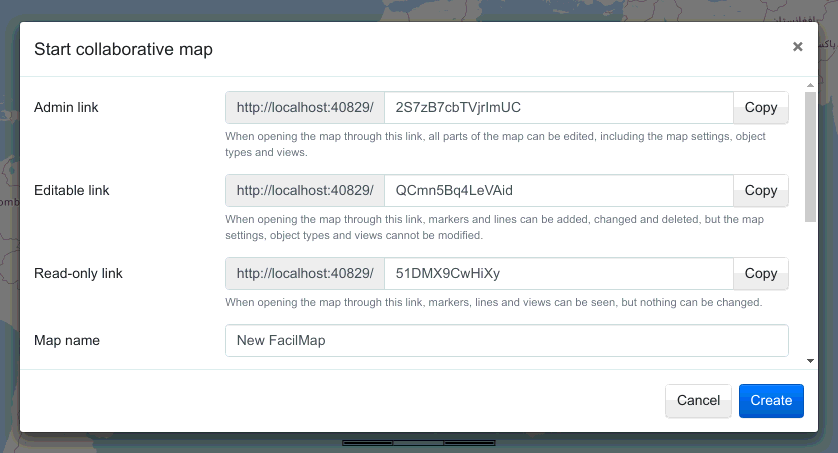

# Collaborative maps

A collaborative map is a map that can be reached under its own unique URL. Users can add markers, lines, routes and various other things to the map, and if multiple people are working on it simultaneously, they all see each others’ changes instantly. Think of it like an [Etherpad](https://etherpad.org/), just for maps.

While using a collaborative map, users can still use all of the non-collaborative features of FacilMap, such as [searching for a place](../search/), [calculating a route](../route/), [adding a map point](../click-marker/) etc. However, only [markers](../markers/) and [lines](../lines/) explicitly added to the map will be saved as part of it and be visible to other users. If you search for a place or calculate a route on a collaborative map, you might see the search results or the route on top of the markers and lines of the map (until you close the search or the route again), but others can still only see the markers and lines of the map. Also, if you move the map around, choose a different [map styles](../layers/) or enable a [filter](../filter/), this will not effect what other users are seeing, unless you save it as a [view](../views/) that other users can open.

When changing something on the map, there is no need to “Save” the map. Changes are applied immediately.

## Create a map

To create a collaborative map, click “Collaborative maps” and then “Create a new map” in the [toolbox](../ui/#toolbox).

The “Admin link”, “Editable link” and “Read-only link” settings are described [below](#urls). The other settings are described under [Map settings](../map-settings/).

## URLs

Every collaborative map has 3 URLs, an admin URL, an editable URL and a read-only URL. Accessing the map through its different URLs will show the same map with the same data, but depending through which URL a user opened the map, they will have different permissions what to do with it. The URL of the map acts as the password to access it: Anyone who has the admin URL will have the ability to administrate the map.

When creating a collaborative map, some random characters are proposed for the different URLs. You are free to change them to something that suits you better, but better not use something that can be guessed easily if you don’t want random people to access your map. If you accidentally gave a map URL to someone who is not supposed to have it, you can always change the URLs later in the [map settings](../map-settings/). Map URLs may contain any characters except slashes (`/`).

### Permissions

| Activity | Read-only | Writable | Admin |
|----------|-----------|----------|-------|
| View [markers](../markers/)/[lines](../lines/) | ✔ | ✔ | ✔ |
| Open [views](../views/) | ✔ | ✔ | ✔ |
| Add/edit/remove [markers](../markers/)/[lines](../lines/) | ✘ | ✔ | ✔ |
| Add/edit/remove [custom types](../types/) | ✘ | ✘ | ✔ |
| Add/remove [views](../views/) | ✘ | ✘ | ✔ |
| Show [edit history](../history/) | ✘ | ✘ | ✔ |
| Change [map settings](../map-settings/) | ✘ | ✘ | ✔ |
| [Delete map](../map-settings/#delete-the-map) | ✘ | ✘ | ✔ |

## Open an existing map

If someone has shared a link to a collaborative map with you, you can simply open that link in your browser to open the map. Alternatively, click “Collaborative maps” and then “Open an existing map” (or, if you are already viewing another map, “Open another map”) in the [toolbox](../ui/#toolbox). A dialog will open where you can paste the link into the text field on top and click “Open” to open the map.

In the bottom section of the dialog you can search for existing collaborative maps that people have [made public](../map-settings/#search-engines). Simply type in a search term and click the search icon to search for maps. You can use `*` as a wildcard and `?` as a single-character wildcard.

## Close a map

If you want to close a collaborative map and go back to the basic FacilMap, click “Collaborative maps” and then “Close …” (where “…” is the name of the open map) in the [toolbox](../ui/#toolbox).

## Bookmark a map

While you can simply add a bookmark in your browser to remember the link to a specific map, FacilMap also brings its own bookmark function.

To bookmark a particular map, open that map and then click “Collaborative maps” and then “Bookmark …” (where “…” is the name of the open map) in the [toolbox](../ui/#toolbox). This will add the map as a new item to the “Collaborative maps” menu. Bookmarks are stored in your browser, so they are not visible to anyone else, but they may get removed if you clean up your browser history.

To reorder, rename or remove bookmarks, click “Manage bookmarks” (only visible if you have any bookmarks).

## Delete a collaborative map

A collaborative map can be deleted in the [Map settings](../map-settings/#delete-the-map).