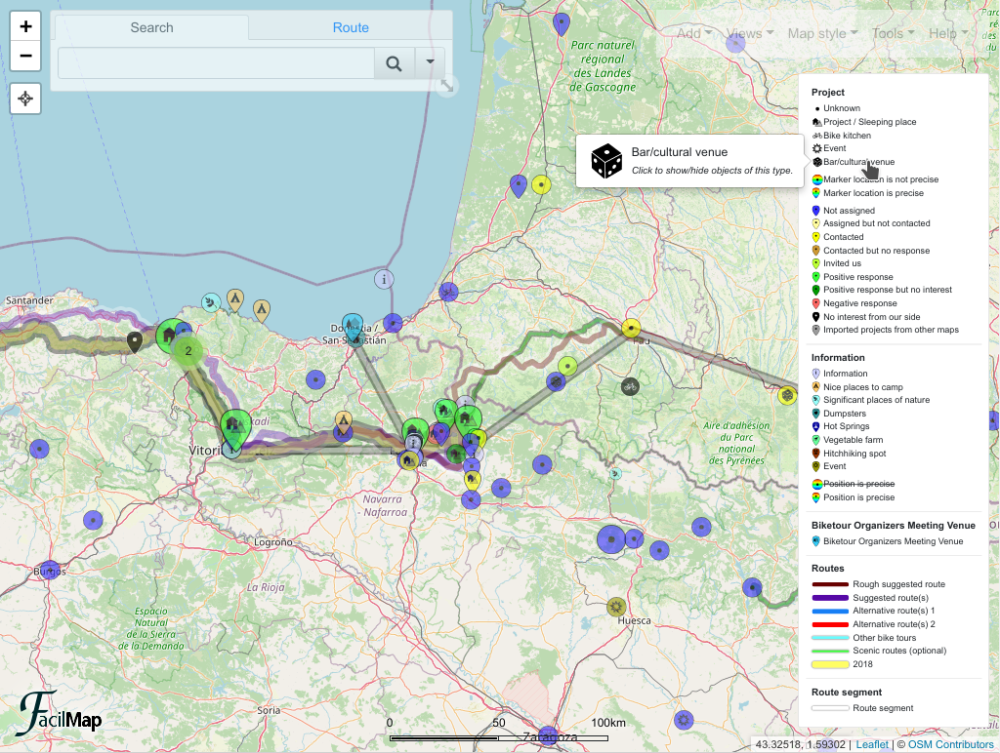

# Legend

A legend describes the meaning of the different styles of items. FacilMap [shows the legend](../ui/#legend) as a box in the bottom right of the screen on big screens and as a [search box](../ui/#search-box) tab on small screens. The legend is shown if [custom legend text](#show-custom-text) is defined or if at least one type is configured to be [shown in the legend](#show-custom-types).

## Show custom text

In the [map settings](../map-settings/), you can define text that is shown above and below the legend. You can use [Markdown](https://github.com/adam-p/markdown-here/wiki/Markdown-Cheatsheet) for formatting.

You need to have the map open through its [admin link](../collaborative/#urls) in order to edit the map settings. In the [toolbox](../ui/#toolbox), click on “Tools” and then “Settings”. Edit the two “Legend text” fields there to add text above and/or below the legend.

## Show custom types

When editing a [type](../types/), checking “Show in legend” will add an item to the legend that represents this type.

If the type has any style properties that are set to “Fixed”, the legend item will represent this style. Otherwise, a generic style is chosen. For example, if a marker type is configured to have its colour fixed as yellow, its shape fixed as a circle and its icon fixed as a heart, the legend item will show a yellow circle marker with a heart. But if a marker has none of its style fixed, the legend item will show a rainbox drop marker without an icon.

<Screencast :desktop="require('./type.mp4')" :mobile="require('./type-mobile.mp4')"></Screencast>

If a type has dropdown or checkbox fields that [control the style](../types/#styles-based-on-field-values), additional legend items are shown for each dropdown option / checkbox state that indicate its style.

<Screencast :desktop="require('./fields.mp4')" :mobile="require('./fields-mobile.mp4')"></Screencast>

For a checkbox, two items are shown that represent the checked and unchecked state and by default have the label “~~Field name~~” (strikethrough) and “Field name”. You can change the labels by editing the checkbox field.

<Screencast :desktop="require('./checkbox.mp4')" :mobile="require('./checkbox-mobile.mp4')"></Screencast>

## Using the legend

Sometimes icons on legend items can be small to see. By hovering over a legend item, a larger version of the icon is shown.

You can click individual items or headings in the legend to hide/show items of this type on the map. Internally, this sets a [filter](../filter/), so it is not persisted on the map and does not affect what other users are seeing, it only temporarily adjusts what you see on the map (unless you persist it as part of a [saved view](../views/)).

<Screencast :desktop="require('./filter.mp4')" :mobile="require('./filter-mobile.mp4')"></Screencast>