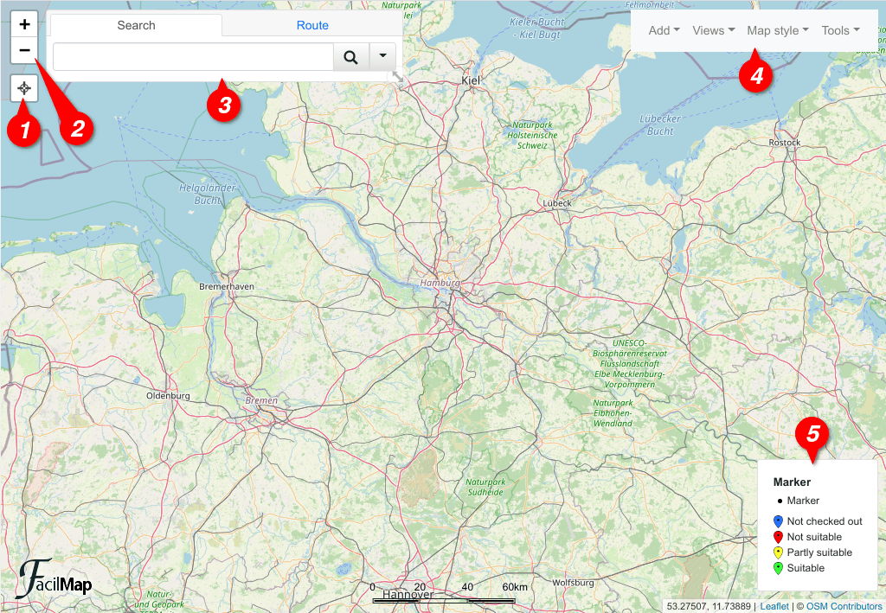
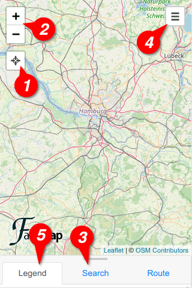

# UI Elements

When opening FacilMap, you can see the following elements on your screen:

1. The locate button. See [Show your location](./locate).
2. The [zoom buttons](#zoom-buttons)
3. The [search box](#search-box)
4. The [toolbox](#toolbox)
5. The legend (only on collaborative maps when enabled). See [Add a legend](./legend).

## Zoom buttons

The zoom buttons allow you to zoom in and out of the map. Alternatively, you can use the mouse wheel on the map to zoom in and out, or on touch devices move two fingers apart or closer together.

## Search box

The search box allows you to [search for places](./search) and to [calculate a route](./route). On small screens, it also contains the [legend](./legend) if enabled.

On top of the search box, you can click the different tabs to switch between different functions. By default, the search box contains two tabs, the search form and the route form. Different functions of the map may temporarily or permanently add additional tabs.

On big screens, you can drag the resize handle on the bottom right of the search box to resize it. Click the resize handle to bring it back to its original size.\
On small screens, the search box appears at the bottom of the screen. You can drag it into and out of view as it fits by dragging the tab bar on top of the search box.

<video controls style="height: 340px">
	<source src="./searchbox.mp4">
</video>
<video controls style="height: 340px">
	<source src="./searchbox-mobile.mp4">
</video>

## Toolbox

The toolbox offers a variety of actions organized into different dropdown menus.

On small screens, the toolbox hides behind the menu button on the top right of the screen. Once the toolbox has been opened, it can be closed by swiping it out of the screen, by clicking the X, or by clicking in the empty space to the left of it.

<video controls style="height: 340px">
	<source src="./toolbox.mp4">
</video>
<video controls style="height: 340px">
	<source src="./toolbox-mobile.mp4">
</video>